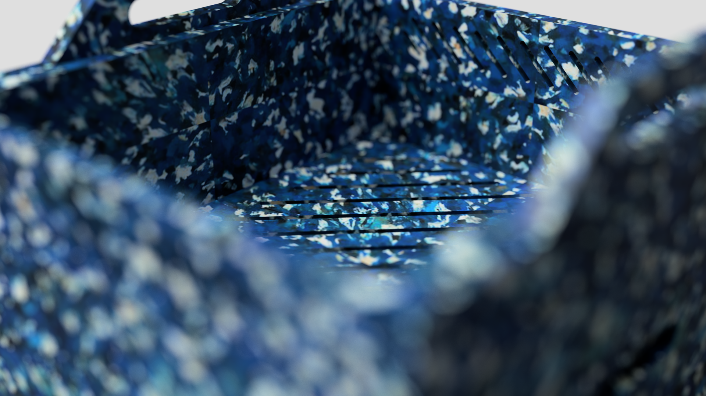
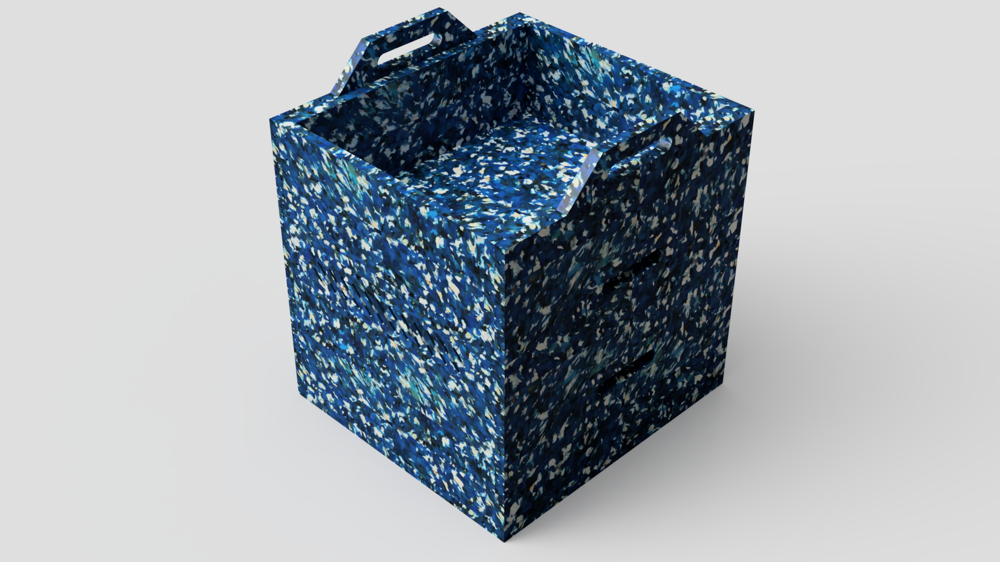
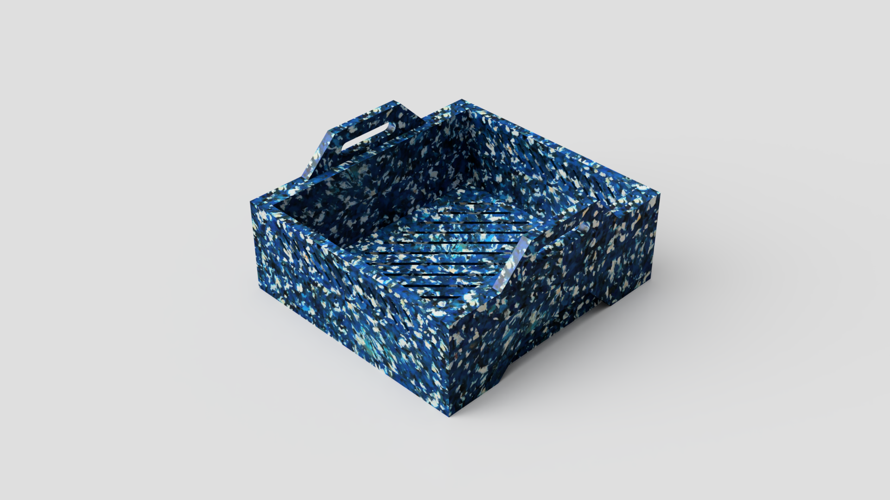
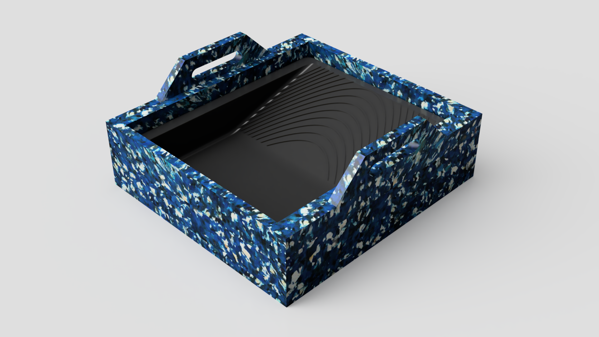

# MoBio 2.0 [PT-BR]

## Sobre o projeto

  

A **MoBio** é uma composteira modular doméstica para cascas e alimentos crus que se assemelha a um mobiliário, cujo objetivo é inseri-la em áreas mais nobres da residência, tais como salas e varandas, o que pode aproximar os moradores ao processo de compostagem e promover um comportamento mais responsável diante das questões ambientais que permeiam a gestão dos resíduos gerados no ambiente doméstico.

Começou a ser desenvolvida em 2020 por meio de Acordo de  Parceria entre o Bacharelado em Design da Universidade Federal do Espírito Santo (Ufes) e dos cursos de Bacharelado em Engenharia Sanitária e Ambiental e Mestrado em Tecnologias Sustentáveis do Instituto Federal do Espírito Santo (Ifes), e recebeu, em 2024, uma patente verde. Esta parceria deu origem à versão 1.0 que é impressa com filamento de base vegetal em uma impressora 3D. Destaca-se que essa versão foi a primeira patente verde do Ifes e terceira da Ufes.

Desde outubro de 2023, este equipamento está em processo de revisão e atualização para aprimorar apontamentos de voluntários em testes de usabilidade e para ser mais barata e  de fácil fabricação, por meio da distribuição do projeto em código aberto e fabricada com contraplacados ou placas de plástico reciclado com ferramentas manuais ou digitais de marcenaria (Fresagem). O projeto da Mobio 2.0 já está disponível para download e pode ser feito através do link abaixo. Se tiver dúvidas, sugestões ou quiser compartilhar melhorias, entre em contato conosco! Ficamos felizes em colaborar e buscar novas soluções em conjunto.

Você pode baixar livremente o arquivo desse produto para fins pessoais, como estudo ou se aventurar a produzir sua própria composteira, **desde que seja para uso pessoal e não para uso comercial**.

## Como usar
Os arquivos para corte CNC encontram-se nas pastas [`dwg`](https://github.com/mobiosustentavel/MoBio-2/tree/main/Files/dwg),[`pdf`](https://github.com/mobiosustentavel/MoBio-2/tree/main/Files/pdf), [`dxf`](https://github.com/mobiosustentavel/MoBio-2/tree/main/Files/dxf). Verifique as instruções contidas nos arquivos antes de iniciar o corte.
Para instruções de montagem e uso acesse: [`Manuais`](https://github.com/mobiosustentavel/MoBio-2/tree/main/Files/Manuais)

# Mobio 2.0 [EN-US]

## About
MoBio is a modular domestic composter designed for raw food scraps and peels, with a form factor that resembles a piece of furniture. Its purpose is to be placed in more prominent areas of the home — such as living rooms and balconies — thereby bringing residents closer to the composting process and encouraging more responsible behavior regarding environmental issues related to household waste management.

Development began in 2020 through a collaborative agreement between the Bachelor’s Program in Design at the Federal University of Espírito Santo (Ufes) and the Bachelor’s Program in Sanitary and Environmental Engineering as well as the Master’s Program in Sustainable Technologies at the Federal Institute of Espírito Santo (Ifes). In 2024, MoBio received a green patent. This partnership resulted in version 1.0, which was manufactured using a 3D printer with a plant-based filament. It is worth noting that this version became the first green patent granted to Ifes and the third to Ufes.

Since October 2023, the equipment has been undergoing review and updates to address feedback from usability tests conducted with volunteers. The goal is to make it more affordable and easier to produce by distributing it as an open-source project, using plywood or recycled plastic panels, and allowing fabrication with manual or digital woodworking tools (CNC routing). The MoBio 2.0 project is now available for download via the link below. If you have any questions, suggestions, or would like to contribute improvements, feel free to contact us — we are happy to collaborate and explore new solutions together.

You are free to download the project files for personal use, such as for educational purposes or to build your own unit. **However, commercial use is not permitted**.

## How to Use
The CNC cutting files are located in the folders [`dwg`](https://github.com/mobiosustentavel/MoBio-2/tree/main/Files/dwg),[`pdf`](https://github.com/mobiosustentavel/MoBio-2/tree/main/Files/pdf), [`dxf`](https://github.com/mobiosustentavel/MoBio-2/tree/main/Files/dxf). Please check the instructions in the file before starting the cutting process. 
For assembly and usage instructions, please visit: [`Manuais`](https://github.com/mobiosustentavel/MoBio-2/tree/main/Files/Manuais)

##

  

  

  

## Mais informações

EDITAL FAPES No 28/2022 - UNIVERSAL

<a href="https://github.com/mobiosustentavel/MoBio-2">MoBio 2.0</a> © 2025 by <a href="https://creativecommons.org">Arthur Carvalho and Alhandra Pereira</a> is licensed under <a href="https://creativecommons.org/licenses/by-nc/4.0/">CC BY-NC 4.0</a>

